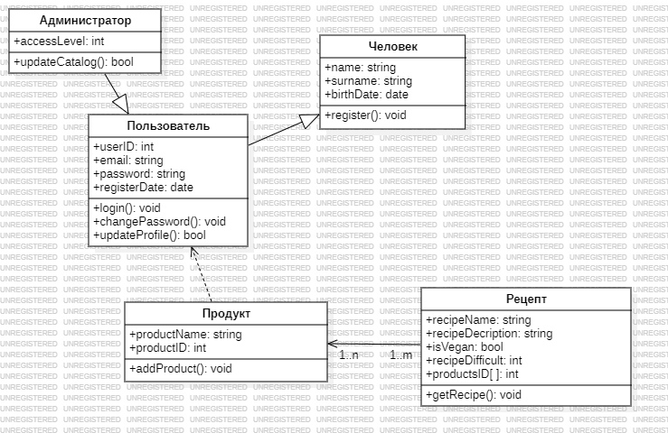
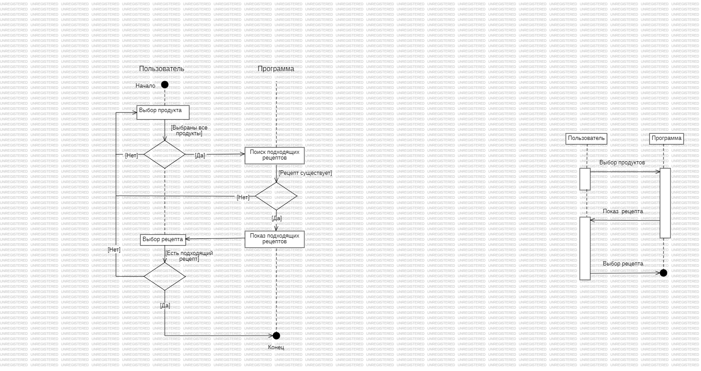
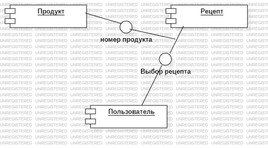
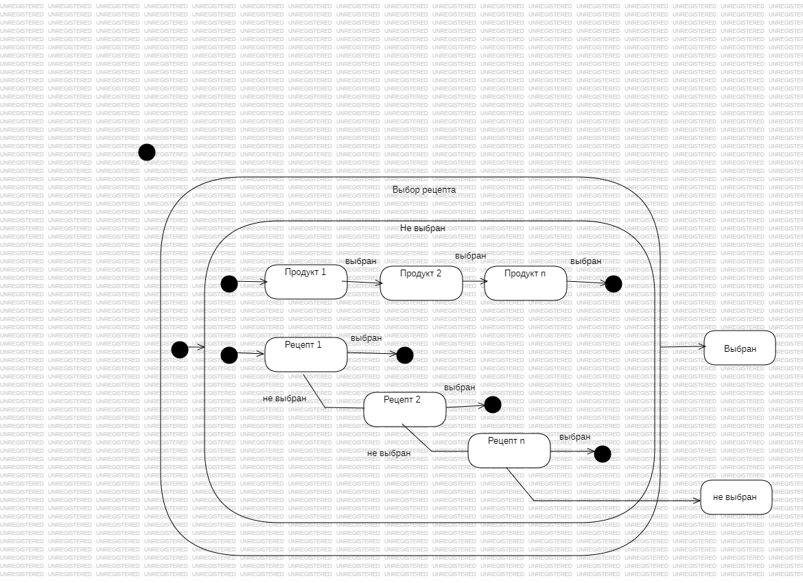
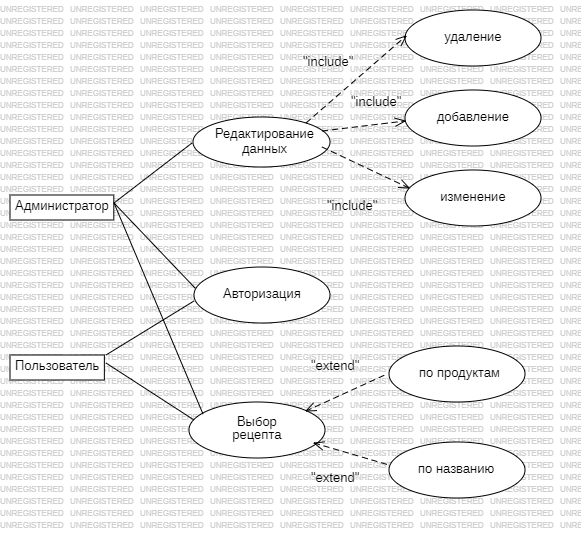

# МАИ 304 кафедра М3О-310Б-21
## Низкоуровневая архитектура программного обеспечения
## Бригада № 8 (Программа подбора рецептов на основе имеющихся продуктов)
- ### [Пысларь Александр Игоревич](https://t.me/alex_pyslar)
- ### Поташников Андрей
- ### Горшков Данил
## Диаграммы:
- ### Классов:

- ### Взаимодействий:

- ### Компонентов:

- ### Состояний:

- ### UseCase:
